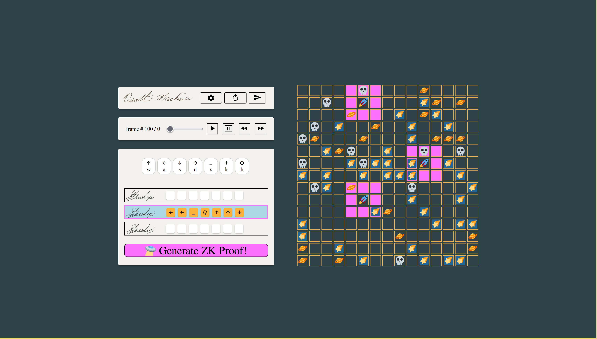

 ##       
 ##       DEATH-MACHINE 💀⚙️

 This is the monorepo for DEATH-MACHINE a smart-contract game on Starknet.  



### System Overiew 

#### Contracts

Cairo contracts.  This directory contains the game code written in cairo, as well as python deployment and testing scripts.  

```
├── ├──  build
├── ├──  deployer
├── ├──  src
├── │  ├──  board
├── │  ├──  death_machine.cairo
├── │  ├──  game
├── │  └──  utils
└── ├──  tests
```

#### Backend

Starknet event indexer using Apibara.

#### Frontend

React Frontend
